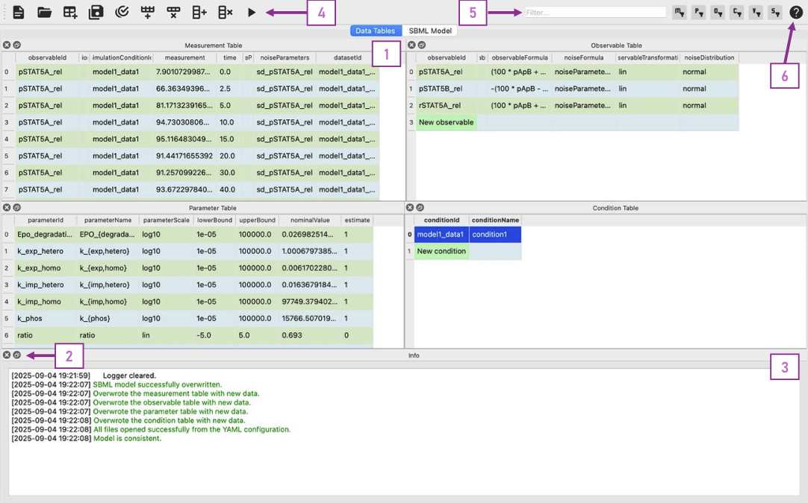

======================
PEtab-GUI Tutorial
======================

This tutorial provides a comprehensive guide to using PEtab-GUI for creating and managing `PEtab <https://petab.readthedocs.io/en/latest/>`__ parameter estimation problems for systems biology models.

.. contents::
   :depth: 3
   :local:

Introduction
------------

PEtab-GUI is a graphical user interface for the `PEtab <https://petab.readthedocs.io/en/latest/>`__ format, which is a standardized way to specify parameter estimation problems in systems biology. This tutorial will guide you through the entire workflow of creating a parameter estimation problem using PEtab-GUI.

Getting Started
---------------

Installation
~~~~~~~~~~~~

Before you begin, make sure you have PEtab-GUI installed. You can install it directly from PyPI using pip:

.. code-block:: bash

   pip install petab-gui

Alternatively, you can install it from the GitHub repository by following these steps:

1. Clone the repository:

   .. code-block:: bash

      git clone https://github.com/PEtab-dev/PEtab-GUI.git

2. Install using pip:

   .. code-block:: bash

      cd PEtab_GUI
      pip install .

Launching the Application
~~~~~~~~~~~~~~~~~~~~~~~~~

To start PEtab-GUI, run the following command:

.. code-block:: bash

   petab_gui

If you want to open an existing PEtab project, you can specify the path to the YAML file:

.. code-block:: bash

   petab_gui path/to/your/project.yaml

The Main Window
---------------

When you first launch **PEtab-GUI**, you'll see the main window as shown below:

   **PEtab-GUI Main Window**: (1) Every Table is in its own dockable panel. Using the buttons in (2) you can get each widget as a separate window or close it entirely. To reopen it, use the :menuselection:`&View` menu in the menu bar.
   (3) The :guilabel:`Info` widget shows log messages and clickable documentation links. Here you will be informed about deleted lines, potential validation problems and more. (4) The toolbar provides quick access to common actions
   like opening/saving files, table modification, and model simulation. (5) The filter allows you to only look at specific rows. The filterbuttons to the right let you select in which tables the filter should be applied.
   (6) If you are unsure what to do, you can enter the **Tutorial Mode** by clicking the question mark icon in the toolbar. This will allow you to click different widgets or columns in the tables to get more information about their purpose.

The interface is organized into several key areas:

- **Menu Bar**:
  At the top, providing access to :menuselection:`&File`, :menuselection:`&Edit`, :menuselection:`&View`, and :menuselection:`&Help`. These items allow you to edit your PEtab problem and navigate the application. Most notably, the :menuselection:`&View` menu allows you to toggle the visibility of the different panels.

- **Toolbar**:
  Below the menu bar, offering quick access to common actions like opening/saving files, table modification, and model simulation.

- **Main Window**:

  The main window of the application can be categorized into two main sections that can be selected via tab navigation:

  - **Data Tables** (left tab):
    Six dockable table panels, each corresponding to a PEtab table (see also the `PEtab Documentation`_):

    * :guilabel:`Measurement Table`: Define experimental observations
      → See: :ref:`measurement-table`
    * :guilabel:`Observable Table`: Specify the formulas and noise models
      → See: :ref:`observable-table`
    * :guilabel:`Visualization Table`: Assign plotting preferences
      → See: :ref:`visualization-table`
    * :guilabel:`Parameter Table`: Set parameter IDs, bounds, and scales
      → See: :ref:`parameter-table`
    * :guilabel:`Condition Table`: Describe experimental conditions
      → See: :ref:`condition-table`
    * :guilabel:`Info` panel: Displays log messages and clickable documentation links
    * :guilabel:`Measurement Plot` panel:
      At the bottom, visualizes the measurement data based on your current model.
      → See: :ref:`visualization-table`

  - **SBML Model** (right tab):
    A built-in editor for creating and editing `SBML <https://sbml.org/>`__ models. It is split into two synced editors:

    * **SBML Model Editor**: For editing the SBML model directly.
    * **Antimony Editor**: For editing the `Antimony <https://github.com/sys-bio/antimony/>`__ representation of the model.

    Changes in these can be forwarded to the other editor, allowing you to work in your preferred format.
    → See: :ref:`sbml-editor`

  .. figure:: _static/SBML_Antimony_Editors.png
    :alt: SBML and Antimony Editors
    :width: 100%
    :align: center

    **SBML and Antimony Editors**: The second tab of the GUI application. The SBML editor (1) allows you to edit the SBML model directly, while the Antimony editor (2) provides a more human-readable format. Changes in one editor can be forwarded to the other using the buttons below them.

We can can now start creating a new PEtab problem or edit an existing one. The following sections will guide you through the process of defining and editing your model, experimental conditions, measurements, observables, and parameters.
While at each step we will learn about the different panels and how to fill the corresponding tables, it might be helpful to have a look at the `PEtab Documentation`_ (`tutorial <https://petab.readthedocs.io/en/latest/v1/tutorial/tutorial.html>`__) to get a better understanding of the PEtab format and its requirements.

Quick Start: Your First PEtab Problem
--------------------------------------

This section provides a complete, hands-on walkthrough to create your first PEtab parameter estimation problem from scratch.
You will create a simple exponential decay model, import measurement data, and validate the complete problem.

**What we'll build**: A model describing first-order exponential decay of a molecular species A, with experimental measurements at different time points.

.. note::

   **Expected time**: 10-15 minutes

   **Sample data files**: Download the example files from the `GitHub repository <https://github.com/PEtab-dev/PEtab-GUI/tree/main/docs/source/examples>`__
   or create them as described below.

Step 1: Launch PEtab-GUI
~~~~~~~~~~~~~~~~~~~~~~~~~

Start PEtab-GUI from the command line:

.. code-block:: bash

   petab_gui

You should see the main window with empty table panels.

.. note::

   **Picture needed**: Screenshot of empty PEtab-GUI main window on first launch
   Caption: "PEtab-GUI on first launch - all tables are empty and ready for a new project"

Step 2: Create the SBML Model
~~~~~~~~~~~~~~~~~~~~~~~~~~~~~~

We'll create a simple model using the Antimony editor.

1. Click on the **SBML Model** tab at the top of the main window
2. In the **Antimony Editor** panel (on the right), enter the following model:

   .. code-block:: antimony

      model *SimpleDecay
        // Reactions
        decay: A -> ; k_decay * A

        // Species initialization
        A = 10.0  # Initial amount of species A

        // Parameters
        k_decay = 0.1  # Decay rate constant
      end

3. Click the **"Antimony → SBML"** button below the Antimony editor
4. You should see the SBML XML representation appear in the **SBML Model Editor** (left panel)

.. note::

   **Picture needed**: Screenshot of the SBML Model tab showing both Antimony editor (right) with the model code and SBML editor (left) with the converted XML
   Caption: "Creating a simple decay model in Antimony (right panel) and converting it to SBML (left panel)"

**What you should see**: The SBML editor should now contain XML code with ``<species>`` and ``<reaction>`` elements.
The Info panel at the bottom might show a message confirming the conversion.

Step 3: Import Measurement Data
~~~~~~~~~~~~~~~~~~~~~~~~~~~~~~~~

Now we'll import experimental measurements.

**Option A: Using the provided sample file**

1. Download ``simple_decay_measurements.csv`` from the examples folder
2. Switch back to the **Data Tables** tab
3. Drag and drop the CSV file onto the **Measurement Table** panel

**Option B: Creating the file yourself**

Create a file named ``simple_decay_measurements.csv`` with the following content:

.. code-block:: text

   observableId,simulationConditionId,measurement,time
   obs_species_A,condition1,10.2,0
   obs_species_A,condition1,7.8,2
   obs_species_A,condition1,5.9,4
   obs_species_A,condition1,4.5,6
   obs_species_A,condition1,3.3,8
   obs_species_A,condition1,2.4,10
   obs_species_A,condition1,1.8,12
   obs_species_A,condition1,1.3,15
   obs_species_A,condition1,1.0,18
   obs_species_A,condition1,0.7,20

Then drag and drop this file onto the **Measurement Table** panel.

.. note::

   **Picture needed**: Screenshot showing drag-and-drop of CSV file onto the Measurement Table, with a cursor icon over the table
   Caption: "Drag-and-drop the measurement CSV file onto the Measurement Table panel for automatic import"

**What you should see**: The Measurement Table should now contain 10 rows with your measurement data.
The Info panel will likely show messages about auto-generated observables and conditions.

.. note::

   **Picture needed**: Screenshot of the Measurement Table populated with the 10 rows of data
   Caption: "Measurement Table after importing data - 10 time points with corresponding measurements for obs_species_A"

Step 4: Define the Observable Formula
~~~~~~~~~~~~~~~~~~~~~~~~~~~~~~~~~~~~~~

PEtab-GUI has automatically created an observable entry called ``obs_species_A`` in the Observable Table,
but we need to specify how this observable relates to our model species.

1. Locate the **Observable Table** panel (you may need to scroll or rearrange panels)
2. Find the row with ``observableId`` = ``obs_species_A``
3. Click on the ``observableFormula`` cell (should be empty or have a placeholder)
4. Enter: ``A``

   This tells PEtab that the observable directly corresponds to the species A in our model.

5. In the ``noiseFormula`` cell, enter: ``0.5``

   This specifies that measurements have a standard deviation of 0.5 units (normally distributed noise).

.. note::

   **Picture needed**: Screenshot of the Observable Table with one row showing obs_species_A, with "A" in observableFormula column and "0.5" in noiseFormula column
   Caption: "Observable Table with the formula 'A' linking the observable to model species A, and noise standard deviation set to 0.5"

**What you should see**: The Info panel might show a validation message confirming the observable is now properly defined.

Step 5: Review Auto-Generated Conditions
~~~~~~~~~~~~~~~~~~~~~~~~~~~~~~~~~~~~~~~~~

Switch to the **Condition Table** panel.

**What you should see**: PEtab-GUI has automatically created an entry for ``condition1`` (referenced in your measurements).
Since our simple model doesn't require any condition-specific parameter overrides or initial value changes, this table
can remain as-is with just the ``conditionId`` column filled.

.. note::

   **Picture needed**: Screenshot of Condition Table showing single row with "condition1" in the conditionId column
   Caption: "Condition Table with auto-generated condition1 - no additional columns needed for this simple model"

Step 6: Configure Parameters for Estimation
~~~~~~~~~~~~~~~~~~~~~~~~~~~~~~~~~~~~~~~~~~~~

Now we specify which parameters should be estimated and their bounds.

1. Switch to the **Parameter Table** panel
2. Click the **"Add Row"** button in the toolbar (or use :menuselection:`&Edit --> Add Row`)
3. Fill in the following values:

   * ``parameterId``: ``k_decay``
   * ``parameterScale``: ``log10`` (select from dropdown)
   * ``lowerBound``: ``0.01``
   * ``upperBound``: ``1.0``
   * ``nominalValue``: ``0.1``
   * ``estimate``: ``1`` (or check the box if it's a checkbox)

.. note::

   We use ``log10`` scale because rate constants often span several orders of magnitude, and optimization works better in log space.

.. note::

   **Picture needed**: Screenshot of Parameter Table with one row showing all the values filled in as specified above
   Caption: "Parameter Table configured for estimating k_decay with bounds [0.01, 1.0] on log10 scale"

**What you should see**: One row in the Parameter Table with all columns filled. The Info panel should not show any errors.

Step 7: Visualize Your Measurements
~~~~~~~~~~~~~~~~~~~~~~~~~~~~~~~~~~~~

Let's see what our measurement data looks like.

1. Make sure the **Measurement Plot** panel is visible at the bottom
   (if not, enable it via :menuselection:`&View --> Measurement Plot`)
2. You should see a plot with time on the x-axis and measurement values on the y-axis
3. The plot should show about 10 data points following an exponential decay pattern

.. note::

   **Picture needed**: Screenshot of the Measurement Plot panel showing the scatter plot of measurements over time (exponential decay curve)
   Caption: "Measurement Plot showing the experimental data - time points vs. measured values for species A"

**Try this**: Click on one of the points in the plot. The corresponding row in the Measurement Table should be highlighted.
Now click on a different row in the Measurement Table - the corresponding point in the plot should be highlighted. This
bidirectional linking helps you explore and validate your data.

Step 8: Run a Simulation
~~~~~~~~~~~~~~~~~~~~~~~~~

Now let's simulate the model with our current parameter values to see how well it fits the data.

1. In the toolbar, click the **"Simulate"** button (usually has a "play" or "gear" icon)
2. Wait a few seconds for the simulation to complete
3. The **Simulation Table** panel should appear (if not, enable it via :menuselection:`&View --> Simulation Table`)
4. Switch to the **Measurement Plot** panel - you should now see both your measurements (dots) and the simulation (line)

.. note::

   **Picture needed**: Screenshot showing the Measurement Plot with both measurement data points (scatter) and simulation line overlaid, showing good agreement
   Caption: "Measurement Plot after running simulation - measurements (dots) and model simulation (line) are shown together. The decay rate k_decay=0.1 provides a good fit to the data."

**What you should see**: A line plot overlaid on your measurement points. If you used the exact values from this tutorial,
the simulation should match the measurements reasonably well since the data was generated with k_decay ≈ 0.1.

Step 9: Validate Your PEtab Problem
~~~~~~~~~~~~~~~~~~~~~~~~~~~~~~~~~~~~

Before saving, let's validate that everything is correct.

1. Click the **"Lint"** button in the toolbar (usually has a checkmark or validation icon)
2. Watch the **Info** panel for validation messages
3. If successful, you should see a green message like: *"PEtab problem is valid"* or *"No errors found"*

.. note::

   **Picture needed**: Screenshot of the Info panel showing green success message after linting (e.g., "PEtab problem is valid")
   Caption: "Info panel showing successful validation - your PEtab problem is ready to use!"

**If you see errors**: Read the error messages in the Info panel. They typically indicate:

* Missing required columns
* Mismatched IDs between tables
* Invalid formulas or syntax errors
* Missing parameter definitions

Click on error messages when possible - they may highlight the problematic cell or provide documentation links.

Step 10: Save Your Project
~~~~~~~~~~~~~~~~~~~~~~~~~~~

Congratulations! Your PEtab problem is complete. Now let's save it.

1. Go to :menuselection:`&File --> Save As`
2. Choose a location and filename (e.g., ``simple_decay_problem.yaml``)
3. Select the format:

   * **PEtab YAML + folder**: Saves a YAML file and a folder with all table/model files
   * **COMBINE Archive (.omex)**: Saves everything in a single compressed archive (recommended for sharing)

4. Click **Save**

**What you should see**: A success message in the Info panel, and the window title should update to show your filename.

.. note::

   **Picture needed**: Screenshot of the save dialog showing the file name input, format selection dropdown, and folder structure
   Caption: "Saving your PEtab problem - choose YAML format for easy editing or COMBINE archive for sharing"

Congratulations!
~~~~~~~~~~~~~~~~

You've successfully created your first PEtab parameter estimation problem! You now have:

✓ An SBML model describing exponential decay
✓ Experimental measurements linked to the model
✓ Observable and condition definitions
✓ Parameters configured for estimation with appropriate bounds
✓ A validated PEtab problem ready for parameter estimation tools

**Next Steps**:

* Try changing the parameter values and re-running the simulation
* Experiment with different observable formulas (e.g., ``2*A`` to test scaling)
* Learn about :ref:`matrix-import` for handling experimental data in matrix format
* Explore the :ref:`visualization-table` for customizing plots
* Read about :ref:`advanced-features` like filtering and batch editing

**Using your PEtab problem**: The saved YAML file can be used with parameter estimation tools like:

* `pyPESTO <https://github.com/ICB-DCM/pyPESTO>`__ - Parameter estimation toolbox
* `COPASI <https://copasi.org/>`__ - Biochemical model simulator and analysis tool
* `AMICI <https://github.com/AMICI-dev/AMICI>`__ - Advanced sensitivity analysis

Opening an Existing PEtab Problem
----------------------------------

If you already have a PEtab problem defined in a YAML file or you have your SBML model already, you can open them directly in PEtab-GUI:

1. Through the menu bar, go to :menuselection:`&File --> &Open`. This will open a file dialog, where you can select your YAML file, SBML model file, or any other PEtab-related files.
2. Alternatively, you can drag and drop your YAML file onto the PEtab-GUI window. The application will automatically handle the file and load the relevant data into the interface.
3. If you want to continue working on an existing PEtab problem, you can also use the :menuselection:`&File --> Recent Files` menu to quickly access recently opened projects.

Creating/Editing a PEtab Problem
--------------------------------

Since a PEtab problem consists of several components, we will go through the process step by step. The following sections will guide you through creating or editing a PEtab problem using the PEtab-GUI.
While there is no strict order in which you have to fill the tables, we will follow a logical sequence that starts with the model definition, followed by measurements, experimental conditions, observables, and parameters.

.. _sbml-editor:

Creating/Editing an SBML Model
~~~~~~~~~~~~~~~~~~~~~~~~~~~~~~

Usually the first step in creating a PEtab problem is to define the underlying SBML model.
Independent of whether you are creating a new model or editing an existing one, you are given the choice between editing
the model directly in `SBML <https://sbml.org>`_ or in the much more readable
`Antimony <https://github.com/sys-bio/antimony/blob/develop/doc/AntimonyTutorial.md>`_ and then converting it to SBML.

.. dropdown:: 💡 Need help understanding what an SBML model is?

   **SBML (Systems Biology Markup Language)** is an XML-based format for representing computational models of biological processes.
   It describes the components of a biological system:

   * **Species**: Molecular entities (proteins, metabolites, genes, etc.) that can change over time
   * **Reactions**: Processes that transform species (e.g., enzymatic reactions, binding/unbinding events)
   * **Parameters**: Constants that define reaction rates, initial concentrations, and other quantities
   * **Compartments**: Physical locations where species exist (e.g., cytoplasm, nucleus, extracellular space)

   SBML files are typically generated by modeling tools or written programmatically. While SBML is precise and machine-readable,
   it can be verbose and difficult to read/write manually. That's why PEtab-GUI supports **Antimony**, a human-readable text
   format that can be easily converted to SBML. If you're new to biological modeling, we recommend starting with Antimony
   and converting to SBML when needed.

   For more information, see the `SBML website <https://sbml.org/>`__ and the
   `Antimony documentation <https://github.com/sys-bio/antimony/blob/develop/doc/AntimonyTutorial.md>`__.

If you are creating a new model, the empty antimony template might help in getting started.
Here is a simple example showcasing how species, reactions, and parameters can be defined:

.. code-block::

   model *ExampleModel
     // Reactions
     J0: S1 -> S2 + S3; k1*S1 # Mass-action kinetics
     J1: S2 -> S3 + S4; k2*S2
     // Species initialization
     S1 = 10 # The initial concentration of S1
     S2 = 0  # The initial concentration of S3
     S3 = 3  # The initial concentration of S3
     S4 = 0  # The initial concentration of S4
     // Variable initialization
     k1 = 0.1 # The value of the kinetic parameter from J0.
     k2 = 0.2 # The value of the kinetic parameter from J1.
   end

.. _measurement-table:

Specifying Measurements
~~~~~~~~~~~~~~~~~~~~~~~

Indispensable for parameter estimation problems are the measurements that will be used to fit the model parameters.
In PEtab-GUI, you can define these measurements in the :guilabel:`Measurement Table`.
While it is possible to create a new measurement table from scratch, it is usually more convenient to import an already
existing measurement file. In our experience, most measurements exist in some matrix format. Time-resolved data might have each
row corresponding to a time point and each column corresponding to a different observable.
Similar can Dose-Response data be structured, where each row corresponds to a different dose.
Accounting for these common formats, PEtab-GUI handles opening a CSV or TSV file by checking whether it is a time series,
dose-response, or a PEtab measurement file. Simply drag and drop your file into the **Measurement Table** or
use the :menuselection:`&File --> &Open` option. In general what we need to specify in the measurement table are:

1. **observableId**: A unique identifier for the observable that this measurement corresponds to. This should match the observable IDs defined in the **Observable Table**.
2. **simulationConditionId**: The condition under which the measurement was taken. You are free to choose a name but it should be consistent with the conditions defined in the **Condition Table**.
3. **time** and **measurement**: The time point and corresponding measurements.

There are a number of optional columns that can be specified, for more details see the `PEtab Documentation`_.

.. _matrix-import:

Importing Matrix-Format Measurement Data
~~~~~~~~~~~~~~~~~~~~~~~~~~~~~~~~~~~~~~~~~

One of PEtab-GUI's most powerful features is its ability to automatically convert matrix-format experimental data into PEtab format.
This is particularly useful because most experimental data is initially organized in matrix layouts.

**Common matrix formats:**

* **Time-series data**: Rows = time points, Columns = different conditions or replicates
* **Dose-response data**: Rows = different doses, Columns = different observables or replicates
* **Multi-condition experiments**: Any tabular layout where measurements are organized by experimental variables

Understanding Matrix Format
^^^^^^^^^^^^^^^^^^^^^^^^^^^^

Matrix format is how experimental data is typically recorded and stored in spreadsheets. Here's an example:

.. code-block:: text

   time,control,low_dose,medium_dose,high_dose
   0,100.5,98.2,101.3,99.7
   2,95.3,88.5,82.1,70.4
   4,90.8,79.8,67.4,50.2
   6,86.2,72.1,55.3,35.8
   8,82.0,65.4,45.6,25.6
   10,78.3,59.6,37.8,18.4

In this format:

* **First column** (``time``): The independent variable (time, dose, etc.)
* **Other columns**: Measurement values for different conditions
* **Column headers**: Become condition names or observable names

This needs to be converted to PEtab's "long format" where each measurement is a separate row with explicit
``observableId``, ``simulationConditionId``, ``time``, and ``measurement`` columns.

**PEtab-GUI handles this conversion automatically!**

Step-by-Step: Importing Matrix Data
^^^^^^^^^^^^^^^^^^^^^^^^^^^^^^^^^^^^

Let's walk through importing the matrix data shown above.

**Step 1: Prepare Your Matrix File**

Create a CSV or TSV file with your matrix data. Requirements:

* First row must contain column headers
* First column should be the independent variable (typically ``time`` or ``dose``)
* Remaining columns contain measurement values
* Use clear, descriptive column names (they will become condition IDs)

For this example, save the matrix data above as ``timeseries_matrix.csv`` (also available in the
`examples folder <https://github.com/PEtab-dev/PEtab-GUI/tree/main/docs/source/examples>`__).

**Step 2: Import the Matrix File**

1. Make sure you have an SBML model already loaded (PEtab-GUI needs to know what species exist)
2. In the **Data Tables** tab, locate the **Measurement Table** panel
3. **Drag and drop** your ``timeseries_matrix.csv`` file onto the Measurement Table

   OR

   Use :menuselection:`&File --> &Open` and select your matrix file

.. note::

   **Picture needed**: Screenshot showing the drag-and-drop action with the matrix CSV file hovering over the Measurement Table panel
   Caption: "Drag-and-drop your matrix-format CSV file onto the Measurement Table for automatic conversion"

**Step 3: Watch the Automatic Conversion**

PEtab-GUI will automatically:

1. **Detect** that your file is in matrix format (not already in PEtab format)
2. **Convert** the matrix to PEtab long format:

   * Each cell in the matrix becomes a separate row in the Measurement Table
   * Column names become ``simulationConditionId`` values (``control``, ``low_dose``, etc.)
   * The first column values become ``time`` values
   * Cell values become ``measurement`` values

3. **Generate observables**: Create entries in the Observable Table (one per matrix column)
4. **Generate conditions**: Create entries in the Condition Table (one per matrix column)

.. note::

   **Picture needed**: Screenshot of the Measurement Table after matrix import, showing the "long format" with multiple rows, each having observableId, simulationConditionId, time, and measurement columns filled
   Caption: "Measurement Table after matrix import - the matrix has been automatically converted to PEtab long format with 40 rows (4 conditions × 10 time points)"

**What you should see**:

* **Measurement Table**: 40 rows (4 conditions × 10 time points), with columns:

  * ``observableId``: Will have values like ``obs_control``, ``obs_low_dose``, etc. (auto-generated)
  * ``simulationConditionId``: Will match the column names from your matrix
  * ``time``: Values from your first column
  * ``measurement``: Values from the matrix cells

* **Observable Table**: 4 new rows, one for each condition column (``control``, ``low_dose``, etc.)
* **Condition Table**: 4 new rows with condition IDs matching your column names
* **Info Panel**: Messages indicating how many observables and conditions were auto-generated

.. note::

   **Picture needed**: Screenshot showing the Observable Table with 4 auto-generated observables (obs_control, obs_low_dose, obs_medium_dose, obs_high_dose), with empty observableFormula columns
   Caption: "Observable Table after matrix import - one observable auto-generated per condition, formulas need to be filled in manually"

**Step 4: Complete the Observable Definitions**

The auto-generated observables need their formulas defined:

1. Switch to the **Observable Table**
2. For each observable (e.g., ``obs_control``, ``obs_low_dose``), fill in the ``observableFormula`` column

   * If all conditions measure the same species, use the same formula (e.g., ``A``)
   * If conditions have different scaling, use appropriate formulas (e.g., ``scale_factor * A``)

3. Fill in the ``noiseFormula`` column (e.g., ``0.5`` for constant noise, or ``0.1*A`` for proportional noise)

.. code-block:: text

   Example Observable Table after completion:
   observableId       | observableFormula | noiseFormula
   obs_control        | A                 | 0.5
   obs_low_dose       | A                 | 0.5
   obs_medium_dose    | A                 | 0.5
   obs_high_dose      | A                 | 0.5

**Step 5: Configure Condition-Specific Parameters**

If your experimental conditions involve different parameter values (e.g., different drug concentrations), add columns to the **Condition Table**:

1. Switch to the **Condition Table**
2. You should see 4 rows: ``control``, ``low_dose``, ``medium_dose``, ``high_dose``
3. Add a column for the parameter that varies (e.g., right-click header → "Add Column")
4. Name it according to your model parameter (e.g., ``drug_concentration``)
5. Fill in the values for each condition:

.. code-block:: text

   Example Condition Table:
   conditionId     | drug_concentration
   control         | 0
   low_dose        | 10
   medium_dose     | 50
   high_dose       | 100

.. note::

   **Picture needed**: Screenshot of Condition Table with a custom column "drug_concentration" showing different values for each condition (0, 10, 50, 100)
   Caption: "Condition Table with condition-specific parameter - drug_concentration varies across the four experimental conditions"

**Step 6: Verify and Visualize**

1. Run a lint check to verify everything is correctly configured
2. View the **Measurement Plot** to see all your data visualized
3. Run a simulation to see how your model fits the data across all conditions

Common Matrix Import Scenarios
^^^^^^^^^^^^^^^^^^^^^^^^^^^^^^^

**Scenario 1: Replicates in Columns**

If your matrix has replicates as separate columns:

.. code-block:: text

   time,sample1_rep1,sample1_rep2,sample1_rep3
   0,10.1,9.8,10.3
   2,7.9,8.1,7.7
   4,6.0,5.8,6.2

PEtab-GUI will treat each column as a separate observable. You can:

* Keep them separate with different observable IDs
* Manually merge them by editing the ``observableId`` column to use the same ID (``sample1``) for all replicates

**Scenario 2: Multiple Observables**

If your matrix contains different observables:

.. code-block:: text

   time,protein_A,protein_B,mRNA_A
   0,100,50,200
   2,95,48,180
   4,90,46,160

Each column will become a separate observable. Ensure you:

* Map each observable to the correct model species in the ``observableFormula``
* Use appropriate noise formulas for each observable type

**Scenario 3: Dose-Response Data**

For dose-response experiments (rows = doses, no time column):

.. code-block:: text

   dose,viability_24h,viability_48h
   0,100,100
   0.1,98,95
   1.0,85,70
   10.0,60,40

PEtab-GUI will:

* Use the first column (``dose``) as the independent variable
* Convert it to a ``time`` column in PEtab (or you can manually rename it)
* Create observables for each subsequent column

Troubleshooting Matrix Import
^^^^^^^^^^^^^^^^^^^^^^^^^^^^^^

**Issue**: Matrix not detected, imported as regular PEtab file

* **Cause**: File already has PEtab column headers (``observableId``, ``simulationConditionId``, etc.)
* **Solution**: Remove PEtab headers and use simple column names

**Issue**: Too many observables created

* **Cause**: Matrix has many columns (e.g., 20+ samples)
* **Solution**: Consider whether all columns represent different observables, or if some are replicates that should share the same ``observableId``

**Issue**: First column not recognized as time

* **Cause**: Column name doesn't match expected patterns
* **Solution**: Ensure first column is named ``time``, ``dose``, or another clear variable name. You can also manually edit the Measurement Table after import.

**Issue**: Special characters in column names cause problems

* **Cause**: Column names with spaces, special characters become problematic IDs
* **Solution**: Use simple alphanumeric names with underscores (e.g., ``high_dose`` instead of ``High Dose (mg/L)``)

Tips for Successful Matrix Import
^^^^^^^^^^^^^^^^^^^^^^^^^^^^^^^^^^

1. **Use clear column names**: These become condition IDs, so make them descriptive but simple
2. **Keep matrix format simple**: Header row + data rows, no extra formatting
3. **One independent variable**: First column should be time, dose, or similar
4. **Consistent data types**: All measurement columns should contain numeric values
5. **Load SBML model first**: PEtab-GUI can better auto-generate formulas if it knows what species exist
6. **Review auto-generated entries**: Always check the Observable and Condition tables after import

**Next Steps After Matrix Import**:

* Define observable formulas in the Observable Table
* Configure condition-specific parameters if needed
* Add parameter definitions to the Parameter Table
* Run linting to validate the conversion
* Visualize and simulate to verify correctness

.. _observable-table:

Defining Observables
~~~~~~~~~~~~~~~~~~~~

Observables define how model species are mapped to measured quantities. When you create a measurement in the
**Measurement Table**, you need to specify which observable it corresponds to. If it is not already defined, PEtab-GUI
will automatically create a new observable entry in the **Observable Table**. You will only have to fill out the actual
function in the **observableFormula** column, which defines how the observable is calculated from the model species. In
the easiest case, this just corresponds to the species ID, e.g. ``S1``. But it could also be a more complex expression like
``k_scale * (S1 + S2)``, that even introduces new parameters, e.g. ``k_scale``.

In general, we assume that the measurement is subject to some noise. Per default the noise is normally distributed and
within the `noiseFormula` column you can specify the standard deviation of the noise. Again, this formula can be a
simple number or a more complex formula introducing new parameters.

For more details, for example on how to change the noise model, see the `PEtab Documentation`_.

.. _condition-table:

Setting Up Experimental Conditions
~~~~~~~~~~~~~~~~~~~~~~~~~~~~~~~~~~

Experimental conditions define the specific settings under which measurements were taken. Aside from the `conditionId` column,
all other columns are optional. The other columns may either set a parameter to take different values across the conditions
or an initial value for a species that is different across conditions (e.g. in case of a dose-response experiment).
Just as in the observable table, new conditions can be created automatically when you create a new measurement in the **Measurement Table**.

.. _parameter-table:

Setting Up Parameters
~~~~~~~~~~~~~~~~~~~~~

The last thing you will want to fill out is the **Parameter Table**. This table defines the parameters that
are part of the estimation problem. This includes parameters from the SBML model, observables, and noise models.
For every parameter you declare in the `estimate` column whether it should be estimated during the parameter estimation or not.
Additionally you specify lower and upper bounds for the parameter values in the `lowerBound` and `upperBound` columns, respectively.
If your parameter is not to be estimated, you need to specify a `nominalValue`. PEtab-GUI aids you in this process by suggesting
parameter IDs from the SBML model you might want to add here.

.. _visualization-table:

Validation and Inspection
-------------------------

Once you have filled out all the tables, it is important to validate your PEtab problem to avoid errors during parameter estimation.
PEtab-GUI supports this through **Visualization and Simulation** and **Linting** features:

  .. figure:: _static/Table_View_PlotView.png
   :alt: SBML and Antimony Editors
   :width: 100%
   :align: center

   **PEtab-GUI with Visualization and Simulation Panels**: Once you have defined measurements, you can add the **Measurement Plot** to visualize your measurements. You can also add the **Simulation Table** and **Visualization Table** to run simulations and visualize the results.
   (1) The three tables can be neatly arranged next to each other. (2) Within the measurement panel, you can click on different plots. If you have specified multiple plots, *All Plots* will show every plot specified, followed by tabs for each individual plot.
   If you have simulations you additionally get a residual plot and a scatterplot of the fit. Through the settings symbol (3) you can change whether you want to plot by observable, condition or defined by the visualization table.

Visualization and Simulation
~~~~~~~~~~~~~~~~~~~~~~~~~~~~

In the :guilabel:`Measurement Plot` panel, you will see a visualization of your measurements. You can click on individual points in the
measurement plot to see the corresponding measurement in the :guilabel:`Measurement Table` and vice versa. This can already help getting an
idea of the dynamics of your model and spot potential outliers in your measurements.

Once you have defined all the necessary components, you might want to see whether a specific parameter set leads to a good fit of the model to the measurements.
For this you can add two panels to the main interface, the :guilabel:`Simulation Table` and the :guilabel:`Visualization Table`.
The **Simulation Table** panel is strictly speaking not part of the PEtab problem definition.
Structurally it is the same as the **Measurement Plot** panel, with the sole difference that the column `measurement`
is replaced by `simulation`.
The **Visualization Table** allows you to specify how the measurements (and simulations) should be visualized. In short:

* every `plotId` corresponds to a specific plot. Rows that have the same `plotId` will be plotted together.
* You specify your `xValues` and `yValues` for each row.
* You can specify additional details, such as offsets and scale. For more details see the `PEtab Documentation`_.

If you dont have simulations yet, you can run a Simulation through the toolbar button, which will automatically fill the **Simulation Table**,
running a simulation with the current parameter values and conditions.

If you have simulations, additional plots can be viewed, such as residual plots, as well as goodness-of-fit plots.

Linting
~~~~~~~

Linting is the process of automatically checking your tables for structural and logical errors during editing.

PEtab-GUI offers two layers of linting support:

- **Partial Linting on Edit**:
  Whenever you modify a single row in any table, PEtab-GUI will **immediately lint that row** in context.
  This allows you to catch errors as you build your PEtab problem — such as missing required fields, mismatched IDs, invalid references, or inconsistent units.

- **Full Model Linting**:
  You can run a complete validation of your PEtab problem by clicking the **lint** icon in the toolbar.
  This performs a full consistency check across all tables and provides more comprehensive diagnostics.

All linting messages — including errors and warnings — appear in the **Info** panel at the bottom right of the interface.
Messages include timestamps, color coding (e.g., red for errors, orange for warnings), and sometimes clickable references or hints.

By using linting early and often, you can avoid many common errors in PEtab problem definition and ensure compatibility with downstream tools.

.. _advanced-features:

Advanced Features
-----------------

PEtab-GUI includes several advanced features to improve your workflow efficiency:

Filtering
~~~~~~~~~

The filter bar at the top of the main window allows you to show only specific rows across multiple tables simultaneously:

1. Enter your filter text in the filter input field (e.g., ``condition1`` or ``obs_``)
2. Use the filter buttons to the right to select which tables the filter should apply to
3. The tables will update to show only matching rows
4. Clear the filter to see all rows again

This is particularly useful for:

* Focusing on specific conditions or observables
* Finding and editing related entries across multiple tables
* Debugging issues with specific IDs

Find and Replace
~~~~~~~~~~~~~~~~

Use the Find & Replace feature for bulk editing:

1. Press :kbd:`Ctrl+F` (or :kbd:`Cmd+F` on macOS) to open the Find & Replace bar
2. Enter the text to find
3. Optionally enter replacement text
4. Use "Find Next" to navigate through matches
5. Use "Replace" or "Replace All" for bulk changes

This is useful for:

* Renaming observables or conditions across all tables
* Fixing typos in multiple cells
* Standardizing naming conventions

Multi-Cell Editing
~~~~~~~~~~~~~~~~~~

You can edit multiple cells at once:

1. Select multiple cells by clicking and dragging, or by holding :kbd:`Shift` or :kbd:`Ctrl` while clicking
2. Type your value and press :kbd:`Enter`
3. All selected cells will be updated with the same value

This is useful for:

* Setting the same parameter bounds for multiple parameters
* Applying the same noise formula to multiple observables
* Filling in default values quickly

Help Mode / Tutorial Mode
~~~~~~~~~~~~~~~~~~~~~~~~~~

Activate Help Mode to get contextual information:

1. Click the **question mark icon** in the toolbar
2. Click on any widget, table column header, or panel to see context-specific help
3. Help information appears in a popup or the Info panel
4. Exit Help Mode by clicking the question mark icon again

This is useful for:

* Learning what each column means
* Understanding what values are expected in specific fields
* Getting quick reference information without leaving the application

Customizable Table Layout
~~~~~~~~~~~~~~~~~~~~~~~~~~

The table panels are fully dockable and customizable:

1. **Drag panel headers** to rearrange panels
2. **Undock panels** by clicking the undock button (window icon) - panels become separate windows
3. **Close panels** you don't need via the close button or :menuselection:`&View` menu
4. **Restore panels** via :menuselection:`&View` menu
5. **Save your layout** - PEtab-GUI remembers your panel arrangement

This allows you to:

* Arrange panels side-by-side for comparison
* Use multiple monitors effectively
* Hide panels you're not currently using
* Create custom layouts for different tasks

Undo and Redo
~~~~~~~~~~~~~

PEtab-GUI supports unlimited undo/redo:

* **Undo**: :kbd:`Ctrl+Z` (or :kbd:`Cmd+Z` on macOS)
* **Redo**: :kbd:`Ctrl+Shift+Z` (or :kbd:`Cmd+Shift+Z` on macOS)

Every table edit is tracked, allowing you to safely experiment and revert changes if needed.

Recent Files
~~~~~~~~~~~~

Access recently opened PEtab problems:

* :menuselection:`&File --> Recent Files` shows your recent projects
* Click any entry to quickly reopen a project
* This is useful when working on multiple PEtab problems

Keyboard Shortcuts
~~~~~~~~~~~~~~~~~~

Common keyboard shortcuts to improve efficiency:

* :kbd:`Ctrl+O` / :kbd:`Cmd+O`: Open file
* :kbd:`Ctrl+S` / :kbd:`Cmd+S`: Save
* :kbd:`Ctrl+Z` / :kbd:`Cmd+Z`: Undo
* :kbd:`Ctrl+Shift+Z` / :kbd:`Cmd+Shift+Z`: Redo
* :kbd:`Ctrl+F` / :kbd:`Cmd+F`: Find & Replace
* :kbd:`Delete`: Delete selected rows
* :kbd:`Ctrl+C` / :kbd:`Cmd+C`: Copy
* :kbd:`Ctrl+V` / :kbd:`Cmd+V`: Paste

Saving Your Project
-------------------

Once you've set up your parameter estimation problem, and sufficiently validated it, you can save your project. This
can be done either as a compressed ZIP file or as a `COMBINE archive <https://combinearchive.org/>`__. You can also save each table as a separate CSV file.

Additional Resources
--------------------

* `PEtab Documentation`_
* `Systems Biology Markup Language (SBML) <https://sbml.org/>`_

.. _PEtab documentation: https://petab.readthedocs.io/en/latest
